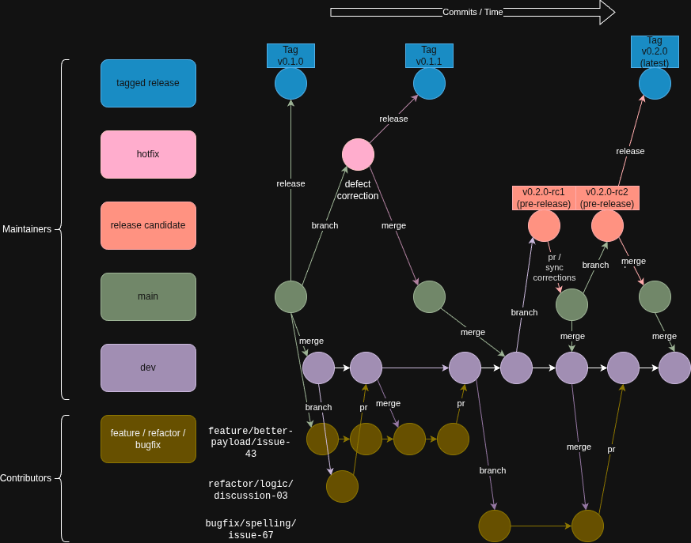

# Contributing

Thank you for your interest in contributing! We need volunteer contributors like you to help grow this project.

You can find us at https://trafficmonitor.zulipchat.com/ for discussions, questions, and immediate community-based assistance. 

Important resources (many coming soon):
- Use GitHub Issues to [report bugs](https://github.com/glossyio/traffic-monitor/issues/new?assignees=&labels=&projects=&template=bug_report.md&title=) and make [feature requests](https://github.com/glossyio/traffic-monitor/issues/new?assignees=&labels=&projects=&template=feature_request.md&title=)
- Use [GitHub Discussions](https://github.com/glossyio/traffic-monitor/discussions/new/choose) to deep-dive and get support.
- [Traffic Monitor Zulic Chat](https://trafficmonitor.zulipchat.com/) to connect with other contributors and chat for community support.
- About us
- Roadmap
- Project management (Taiga)

## Testing

There's no CI yet, and most of the project is tested by installing it on a Raspberry Pi. The database schema has an automated test suite that runs on any machine with Python 3.11 or newer. Set up the dev environment once, from the repo root:

    python3 -m venv .venv
    .venv/bin/pip install -r script/requirements-dev

Then run the tests:

    .venv/bin/python -m pytest container/node-red-tm/schema/tests

Add new development tools to `script/requirements-dev` so everyone uses the same environment. Help us extend testing to the rest of the project!

To deploy to a bench Pi from your dev machine and keep a log of what you tested on it, see [script/devpi/README.md](script/devpi/README.md).

## Submitting changes

Please send a [GitHub Pull Request to this repo](https://github.com/glossyio/traffic-monitor/compare/dev...bugfix/yourfix) to the `dev` branch with a clear list of what you have done (read more about [pull requests](http://help.github.com/pull-requests/)). Please follow our coding conventions (below) and make sure all of your commits are atomic (one feature per commit), or we will squash commits.

Always write a clear log message for your commits. One-line messages are fine for small changes, but bigger changes should look like this:

    $ git commit -m "A brief summary of the commit
    > 
    > A paragraph describing what changed and its impact."

## Use of AI tools

The Traffic Monitor is built and maintained by people. You may use AI coding assistants, such as Claude Code or GitHub Copilot, to draft, review, or explain code and documentation, but a person reviews, tests, and owns every change:

- **You own what you submit.** Read, understand, and test every AI-drafted line before you commit it, and be ready to explain any change in review as if you had written it yourself. We appreciate your contributions and ask questions because we are interested and care about the work, not to question your integrity or purpose.
- **Protect privacy when sharing device data.** Our privacy-by-design promise covers how we build the software, too:
  - Never share images, video clips, or license plate reads.
  - `tmdb.sqlite` is [de-identified](docs/data-and-payloads/data-overview.md#data-privacy) with default settings, so you may use it with AI tools if the device operator explicitly consents. If plate recognition was ever enabled, the database holds plate numbers and is no longer de-identified, so don't share it.
  - Use placeholders for secrets; AI tools never need real passwords, API keys, or tokens. That covers everything in `.env` files, the tokens in `config.yml` (which is otherwise fine to share), and any that turn up in logs.
- **Respect the license.** Contributions are licensed under GPL-3.0. Don't submit AI output that copies third-party code you can't license that way. We understand this is ironic considering how LLMs have been trained, but we want to state it for best effort.
- **Keep AI markers out of the code.** Skip "generated by AI" comments; the commit history is the record (see below).
- **Label AI-assisted commits** with the trailers below, and tick the AI-assistance box in the pull request template. A commit without an `Assisted-by` trailer is your statement that no AI tool drafted or reviewed it.

End the commit message with these trailers, filled in for your tool:

    Assisted-by: Claude Code 2.1.287 (CLI)
    AI-Model: Claude Opus 5.5 (claude-opus-5-5)
    AI-Effort: max
    AI-Role: drafted

- `Assisted-by`: the tool, its version, and the interface you used (CLI, VS Code, JetBrains, desktop app, or web).
- `AI-Model`: the model's name and ID.
- `AI-Effort`: the effort or reasoning setting, if your tool has one; otherwise leave the line out.
- `AI-Role`: `drafted` if the commit contains AI-written content, or `review only` if the AI only reviewed or advised.

In Claude Code, `claude --version` prints the version and `/model` shows the model and effort level. Keep `Co-authored-by` for human co-authors. To list the AI-assisted changes to a file, run `git log --grep='^Assisted-by:' -- <path>`.

Maintainers: when squash-merging, keep these trailers at the end of the final commit message.

## Coding conventions
See our current code to help you get the hang of it:
- Indent with 4 spaces
- This is open source software. Consider the people who will read your code, and make it look nice for them.
- We use Linux line endings (see [GitHub Docs - About line endings](https://docs.github.com/en/get-started/getting-started-with-git/configuring-git-to-handle-line-endings))

## Branching strategy / git workflow
Contributors submit PRs against `dev`. 

When a user performs a `git clone`, it will pull down the `main` branch, which shall be tied to the latest stable release. We still recommend you use tagged releases for production deployments.



## Git naming convention / branch naming
Shall:
- Include a short descriptive summary in imperative present tense
- Use Hyphens for separating words

Should:
- Include the work type:
  - `feature` for new functionality
  - `refactor` for update to existing functionality
  - `bugfix` for corrections to existing functionality
  - `hotfix` for critical fix to main
- Include corresponding ticket/story id (e.g. from Jira, GitHub issue, etc.)

Suggested Format:   
`{work-type}/{short-summary}/{story-issue-ticket-id}`

Example:
```git
git checkout -b feature/oauth-migration/ATL-244
```
## Thank you!
Thank you for your interest and contributions!