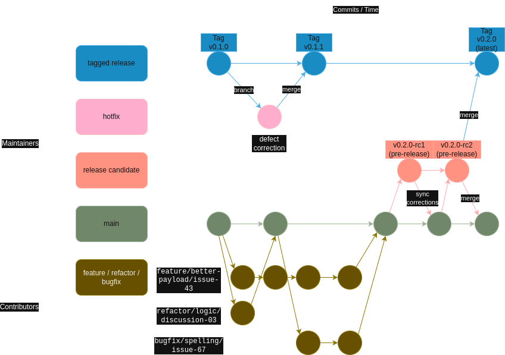

# Contributing

Thank you for your interest in contributing! We need volunteer contributors like you to help grow this project.

You can find us at https://trafficmonitor.zulipchat.com/ for discussions, questions, and immediate community-based assistance. 

Important resources (many coming soon):
- Use GitHub Issues to [report bugs](https://github.com/glossyio/traffic-monitor/issues/new?assignees=&labels=&projects=&template=bug_report.md&title=) and make [feature requests](https://github.com/glossyio/traffic-monitor/issues/new?assignees=&labels=&projects=&template=feature_request.md&title=)
- Use [GitHub Discussions](https://github.com/glossyio/traffic-monitor/discussions/new/choose) to deep-dive and get support.
- [Traffic Monitor Zulic Chat](https://trafficmonitor.zulipchat.com/) to connect with other contributors and chat for community support.
- About us
- Roadmap
- Project management (Taiga)

## Testing

We have not implemented a testing framework. Help us by suggesting or creating one!  

## Submitting changes

Please send a [GitHub Pull Request to this repo](https://github.com/glossyio/traffic-monitor/compare) with a clear list of what you have done (read more about [pull requests](http://help.github.com/pull-requests/)). Please follow our coding conventions (below) and make sure all of your commits are atomic (one feature per commit).

Always write a clear log message for your commits. One-line messages are fine for small changes, but bigger changes should look like this:

    $ git commit -m "A brief summary of the commit
    > 
    > A paragraph describing what changed and its impact."

## Coding conventions
See our current code to help you get the hang of it:
- Indent with 4 spaces
- This is open source software. Consider the people who will read your code, and make it look nice for them.
- We use Linux line endings (see [GitHub Docs - About line endings](https://docs.github.com/en/get-started/getting-started-with-git/configuring-git-to-handle-line-endings))

## Branching strategy / git workflow
We currently employ the `main` branch as default for PRs and maintain it as the development branch and create tagged released for general consumption. Remember when you perform a `git clone` it will pull down the `main` branch by default with all the development code. We recommend you only use tagged releases for non-development deployments.



## Git naming convention / branch naming
Shall:
- Include a short descriptive summary in imperative present tense
- Use Hyphens for separating words

Should:
- Include the work type:
  - `feature` for new functionality
  - `refactor` for update to existing functionality
  - `bugfix` for corrections to existing functionality
  - `hotfix` for critical fix to main
- Include corresponding ticket/story id (e.g. from Jira, GitHub issue, etc.)

Suggested Format:   
`{work-type}/{short-summary}/{story-issue-ticket-id}`

Example:
```git
git checkout -b feature/oauth-migration/ATL-244
```
## Thank you!
Thank you for your interest and contributions!