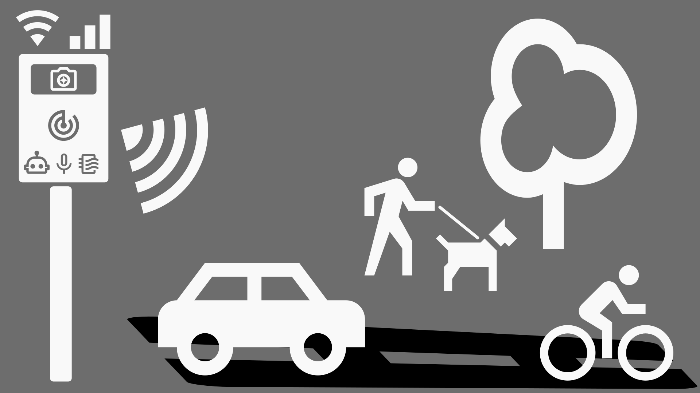
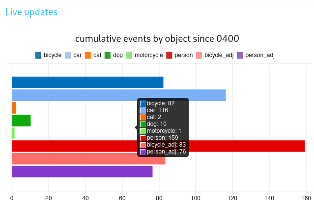
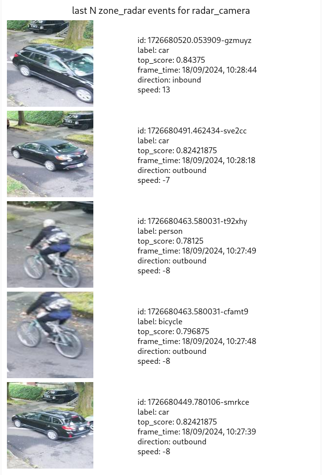
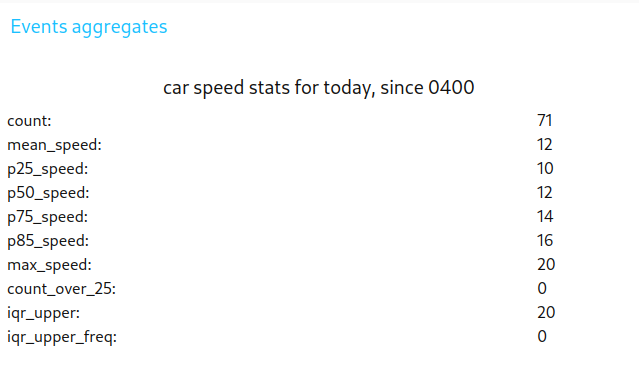
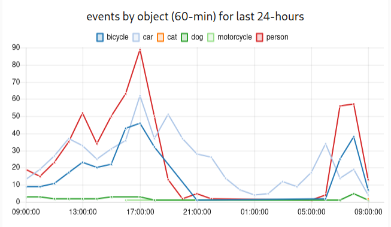
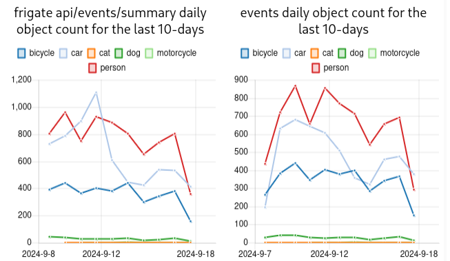
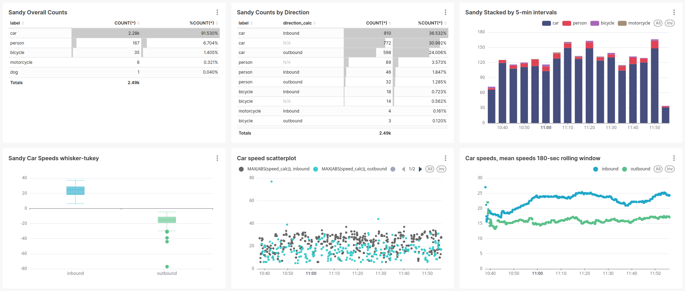

# Traffic Monitor

The Traffic Monitor is an open source smart city traffic monitoring software built with commodity hardware to capture holistic roadway usage. Utilizing edge machine learning object detection and Doppler radar, it counts pedestrians, bicycles, and cars and measures vehicle speeds.

## Highlights and capabilities
- 🧮 Reporting roadway utilization - counting cars 🚗, bicycles 🚲, pedestrians 🚶, and more! 🐕🐈🏍️🚜
- 🚨 Capturing roadway users' speeds - measuring speeds, capturing image and video of event.
- 📷 Privacy-focused, local inferencing (no cloud required) only collects and sends data you specify.
- 🐘 Permanent, long-term deployment on roadways to monitor roadway usage.
- 🐜 Temporary, remote deployments utilizing the low-power footprint and batteries.
- 💡 Extensible with any Raspberry Pi-compatible senosrs and components; e.g. Air Quality sensor for analog gas: RED, OX, NH3, noise, light, proximity, temperature, pressure, humidty and Particulate Matter (PM 5, 2.5, 1).

## Documentation 📚
_Coming soon._

## Build your own device (DIY) 🧑‍🔬

### Getting Started
1. Assemble your device (see [hardware components](#hardware-components) ⚒️).
1. Install [Raspberry Pi OS](https://www.raspberrypi.com/software/) (Full Install) Bookworm (latest). 
    - Full Install required for all components to run properly. Lite is missing H.264 codec for libcamera.
    - Recommend to [Install using Imager](https://www.raspberrypi.com/documentation/computers/getting-started.html#install-using-imager) instructions and follow the [OS customization](https://www.raspberrypi.com/documentation/computers/getting-started.html#advanced-options) to set up your Wi-Fi credentials and username and password to access the device headless (no monitor or keyboard).
1. Insert the microSD card and start your device
    - First boot may take a few minutes before it is fully online
1. [Remotely access your device](https://www.raspberrypi.com/documentation/computers/remote-access.html#introduction-to-remote-access) (recommend using SSH) and login to your Raspberry Pi
    - Recommend use IP Address in case your router doesn't recognize the hostname you set during setup.
1. Run `git clone https://github.com/glossyio/traffic-monitor` into your home folder (or any folder)
1. Run `bash traffic-monitor/script/tmsetup.sh`
1. Access the application at the following URLs (check container status with `docker ps`):
    1. `http://<device_ip_address>:1880/ui` is your primary device dashboard, use it to ensure it is capturing events (Node-Red dashboard)
    1. `http://<device_ip_address>:5000` to view the Frigate interface and make any configuration changes specific to your deployment
1. Mount your device in a place it can capture the entire roadway in the mounting guide (coming soon).
1. [Configure your device](#configuration)
1. Start capturing roadway usage data!

### Hardware Components 🛠️
This setup uses commidity, consumer hardware to enable object detection and speed/direction measurement:
- 👉 (Required) [Raspberry Pi 5](https://www.raspberrypi.com/products/raspberry-pi-5/) 
    - Note: The Raspberry Pi 4B is not recommended as it does not meet the power requirements on the peripherals (USB) for the TPU and radar for this setup.
    - 👉 (Required) A high-quality microSD card (>= 32GB with minimal snapshot and video capture). Recommend a high performance card, even when configuring for minimal recording. Setup has been tested and works well with the [SanDisk Extreme Pro microSDXC UHS-I Card](https://www.westerndigital.com/products/memory-cards/sandisk-extreme-pro-uhs-i-microsd?sku=SDSQXCD-128G-GN6MA).
    - (Recommended) The official [27W USB-C Power Supply](https://www.pishop.us/product/raspberry-pi-27w-usb-c-power-supply-black-us/) for testing and permanent mounts.
- 👉 (Required) [Raspberry Pi Camera Module 3](https://www.raspberrypi.com/products/camera-module-3/) or [Global Shutter](https://www.raspberrypi.com/products/raspberry-pi-global-shutter-camera/) for object detection (requires a [RPi 5 Camera Cable](https://www.raspberrypi.com/products/camera-cable/)).
    - 👉 (Required with camera) [Coral AI Tensor Processing Unit (TPU)](https://coral.ai/products/). The [Coral USB Accelerator](https://coral.ai/products/accelerator) is easy-to-use co-processor and capable of 100+ FPS with millisecond inference time. Other co-processors may work, but this is supported natively in [Frigate](https://github.com/blakeblackshear/frigate).
- (Recommended) [OmniPreSence OPS243-A Doppler Radar Sensor](https://omnipresense.com/product/ops243-doppler-radar-sensor/) - provides accurate radar-based speed/direction detection.
- (Optional) Air Quality sensor ([Enviro+](https://www.pishop.us/product/enviro-for-raspberry-pi/)) with [Particulate Matter (PM) Sensor](https://www.pishop.us/product/pms5003-particulate-matter-sensor-with-cable/)
- External enclosure and internal mounting board need to be custom made at the moment, instructions coming soon.

_We are not affiliated with any of the stores or companies linked in this section. These are just suggestions that have been used or tested. If you have used or tested more, submit a PR to add them!_

## Configuration ✅
Access configuration at `http://<device_ip_address>:1880/ui` > `Configuration/Setup Tab`
1. Set up [Frigate zones](https://docs.frigate.video/configuration/zones) by entering the Frigate UI at `http://<device_ip_address>:5000`, clicking the primary camera, selecting `Debug > Show Options > Mask & Zone creator`. For dashboard and data capture to work properly, you should set up the following 4 named zones:
    1. `zone_capture` - Set to capture the entire roadway, including sidewalks that are clearly in view for counting objects through them.  Avoid edges where poles and trees may occlude a clear view of objects.
    1. `zone_far` - Paired with `zone_near`, this will determine if an object moves "outbound" or "inbound". Set this to be roughly the further half of the `zone_capture` region.
    1. `zone_near` - Paired with `zone_far`, this will determine if an object moves "outbound" or "inbound". Set this to be roughly the closer half of the `zone_capture` region.
    1. `zone_radar` - This should correspond to the field of view for the radar (where it can pick up accurate measurements) on the street. It will roughly make a rectangle in the center of the camera field of view from curb to curb.
1. Set up the deployment location at at `http://<device_ip_address>:1880/ui` > `Configuration/Setup Tab` > Deployment Location Entry Details

## User Interfaces (UI) / port numbers references 🖥️
- `http://<device_ip_address>:1880/ui` is the [Node-RED](https://nodered.org/) dashboard and your primary device dashboard, use it to ensure it is capturing events, see the latest events, and see summarized stats.
- `http://<device_ip_address>:5000` to view the [Frigate](https://github.com/blakeblackshear/frigate) interface and make any configuration changes specific to your deployment
- `http://<device_ip_address>:1984` shows the [go2rtc](https://github.com/AlexxIT/go2rtc) configured camera settings on the Raspberri Pi. Use this if your cameras are giving errors in Frigate.
- `http://<device_ip_address>:1880` is the Node-RED flow editor used to develop the logic to connect events to speeds, create event records, capture radar readings, and more. This is primarily used by developers. The default admin login is admin/password.

## Troubleshooting ⚠️

_More documentation coming soon._

If the Frigate camera shows nothing, check the configuration, review the [Frigate Camera Setup](https://docs.frigate.video/frigate/camera_setup) documentation.
- In Frigate --> Configuration Editor:
    - Enable camera(s) (`cameras` --> `enabled: True`)
    - Enable detection (`detect` --> `enabled: True`)

## Screenshots
Device dashboard available at `http://<device_ip_address>:1880/ui`.

Cumulative events by object for the day (resets daily).

Last 5 events detected and confirmed by radar.

Car object speed statistics for the day (resets daily).

Hourly events count by object for the last 24-hours.

Daily events count by object for the last 10-days.

Dashboard sample, using the granular backend data
