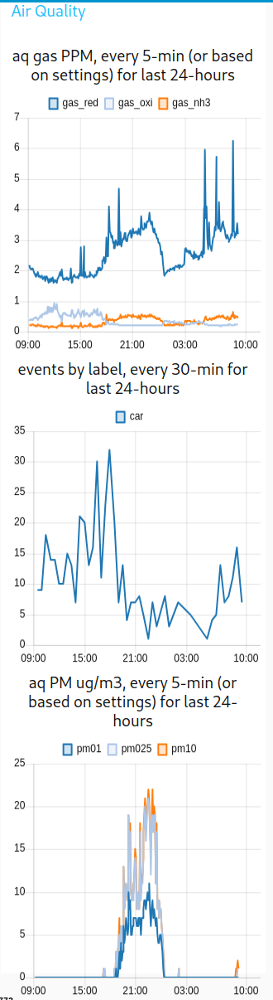

# Traffic Monitor

[TrafficMonitor.ai](https://www.trafficmonitor.ai/), the Traffic Monitor, is an open source smart city traffic monitoring software built with commodity hardware to capture holistic roadway usage. Utilizing edge machine learning object detection and Doppler radar, it counts pedestrians, bicycles, and cars and measures vehicle speeds.

## Highlights and capabilities
- 🧮 Reporting roadway utilization - counting cars 🚗, bicycles 🚲, pedestrians 🚶, and more! 🐕🐈🏍️🚜
- 🚨 Capturing roadway users' speeds - measuring speeds, capturing image and video of event.
- 📷 Privacy-focused, local inferencing (no cloud required) only collects and sends data you specify.
- 🐘 Permanent, long-term deployment on roadways to monitor roadway usage.
- 🐜 Temporary, remote deployments utilizing the low-power footprint and batteries.
- 💡 Extensible with any Raspberry Pi-compatible senosrs and components; e.g. Air Quality sensor for analog gas: RED, OX, NH3, noise, light, proximity, temperature, pressure, humidty and Particulate Matter (PM 5, 2.5, 1).

## Documentation 📚
Visit our official documentation at [docs.trafficmonitor.ai](https://docs.trafficmonitor.ai/) for an introduction, recommended hardware, deployment and mounting guide, setup guide, configuration, data payloads, and more.

## Build your own device (DIY) 🧑‍🔬

### Getting Started

See the [Getting Started](https://docs.trafficmonitor.ai/getting-started) docs for full walkthrough.

1. Assemble your device (see [hardware components](#hardware-components) ⚒️).
1. Install [Raspberry Pi OS](https://www.raspberrypi.com/software/) (Full Install) Bookworm (latest) using the [Raspberry Pi Imager](https://www.raspberrypi.com/documentation/computers/getting-started.html#install-using-imager)
1. Access your Raspberry Pi: See [Connect to your Device](https://docs.trafficmonitor.ai/setup-guide#connect-to-your-device).
1. Install the Traffic Monitor software:
    1. Run `git clone https://github.com/glossyio/traffic-monitor` into your home folder (or any folder)
    1. Run `cd traffic-monitor` 
    1. Run `sudo chmod +x script/*` to enable scripts
    1. Run `./script/bootstrap` to fulfill dependencies. *Note*: System will reboot after this script.
    1. After reboot, log into the device and `cd traffic-monitor` to continue.
    1. Run `./script/setup` to set up project in an initial state
    1. Run `./script/server` to start the application
        - `./script/update` is not required on initial setup but may be used if you change Docker configurations. This *does not* yet automatically update the traffic monitor.
1. Deploy your device:  See the [Deployment and Mounting Guide](https://docs.trafficmonitor.ai/deployment-and-mounting-guide).
1. Set up zones, location, and enable your sensors: See [Setup Guide](https://docs.trafficmonitor.ai/setup-guide).
1. Start capturing roadway usage data!

### Hardware Components 🛠️
The Traffic Monitor is designed on the [Raspberry Pi 5](https://www.raspberrypi.com/products/raspberry-pi-5/) and a variety of commidity hardware to keep it accessible, low-cost, upgradable, and repairable.  See [Recommended Hardware](https://docs.trafficmonitor.ai/build-your-own-device-diy/recommended-hardware) docs for more information.

## Configuration ✅
See [Setup Guide](https://docs.trafficmonitor.ai/setup-guide).

## User Interfaces (UI) / port numbers references 🖥️
- `http://<device_ip_address>:1880/ui` is the [Node-RED](https://nodered.org/) dashboard and your primary device dashboard, use it to ensure it is capturing events, see the latest events, and see summarized stats.
- `http://<device_ip_address>:5000` to view the [Frigate](https://github.com/blakeblackshear/frigate) interface and make any configuration changes specific to your deployment
- `http://<device_ip_address>:1984` shows the [go2rtc](https://github.com/AlexxIT/go2rtc) configured camera settings on the Raspberri Pi. Use this if your cameras are giving errors in Frigate.
- `http://<device_ip_address>:1880` is the Node-RED flow editor used to develop the logic to connect events to speeds, create event records, capture radar readings, and more. This is primarily used by developers. The default admin login is admin/password.

## Troubleshooting ⚠️

No events are being captured? Review the [Setup Guide](https://docs.trafficmonitor.ai/setup-guide) to ensure the zones are properly set up and the camera is enabled and detecting:
- In Frigate > Settings> Configuration Editor:
    - Enable camera(s) (`cameras` --> `enabled: true`)
    - Enable detection (`detect` --> `enabled: true`)
- In Node-RED: 
    - Enable camera(s) (`sensors` --> `cameras` --> `your_cam_name` --> `enabled: true`)

If you are having detection issues, review the [Frigate Camera Setup](https://docs.frigate.video/frigate/camera_setup) documentation.

## Screenshots
Device dashboard available at `http://<device_ip_address>:1880/ui`.

Cumulative events by object for the day (resets daily).

Last 5 events detected and confirmed by radar.

Car object speed statistics for the day (resets daily).

Hourly events count by object for the last 24-hours.

Daily events count by object for the last 10-days.

Dashboard sample, using the granular backend data

Air Quality sample

