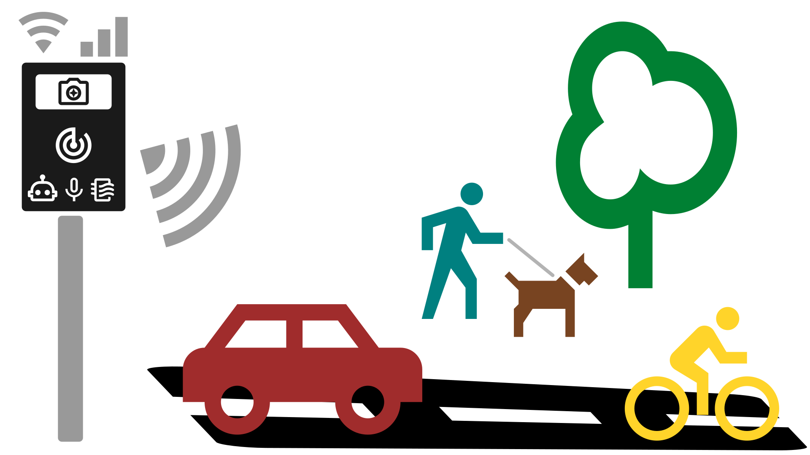

# Welcome to smart city traffic monitoring

The Traffic Monitor is an open source smart city traffic monitoring software built with commodity hardware to capture holistic roadway usage. Utilizing edge machine learning object detection and Doppler radar, it counts pedestrians, bicycles, and cars and measures vehicle speeds.

<figure><picture><source srcset=".gitbook/assets/tm-roadway-graphic-1920x1080-color-bg_black (1).png" media="(prefers-color-scheme: dark)"></picture><figcaption>
Be Counted!
</figcaption></figure>

Our mission is to _democratize the power of AI tools_ to _improve community safety and quality of life_ through the _ethical and transparent use of AI_.&#x20;

Find our website at [trafficmonitor.ai](https://www.trafficmonitor.ai) to sign up for the newsletter.&#x20;

The traffic monitor software and hardware are open source and available for anyone to build, modify, improve, and contribute back. We welcome your ideas and contributions at the [Traffic Monitor GitHub](https://github.com/glossyio/traffic-monitor) repository!

<table data-view="cards"><thead><tr><th></th><th></th><th data-hidden></th><th data-hidden data-card-target data-type="content-ref"></th></tr></thead><tbody><tr><td><a href="getting-started.md">Getting Started</a></td><td>Start counting!</td><td></td><td><a href="getting-started.md">getting-started.md</a></td></tr><tr><td><a href="help-and-faq/frequently-asked-questions.md">Help &#x26; FAQ</a></td><td>Find answers to common issues In addition to <a href="https://github.com/glossyio/traffic-monitor/discussions">discussions</a>, <a href="https://github.com/glossyio/traffic-monitor/issues">issues</a>, and <a href="https://trafficmonitor.zulipchat.com/">chat</a>.</td><td></td><td></td></tr><tr><td><a href="development/contributing.md">Contribute</a></td><td>Contribute back to the open source project</td><td></td><td></td></tr></tbody></table>

Made possible thanks to these incredible, unrelated projects:

* [Frigate NVR project](https://github.com/blakeblackshear/frigate) (core Object Detection application)
* [Node-RED](https://nodered.org/) (low-code programming environment)
