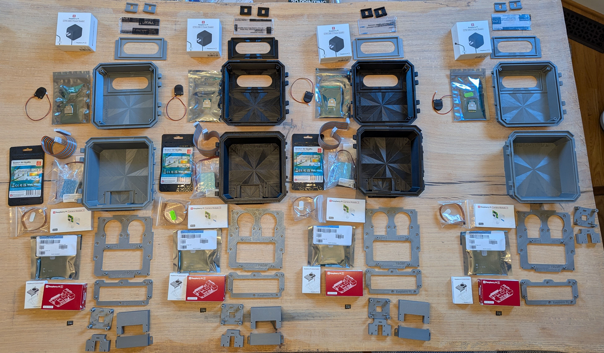
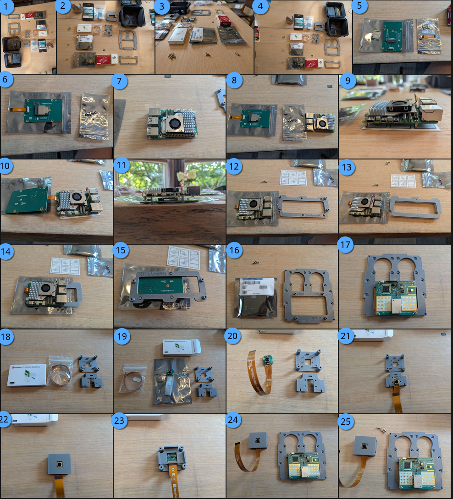
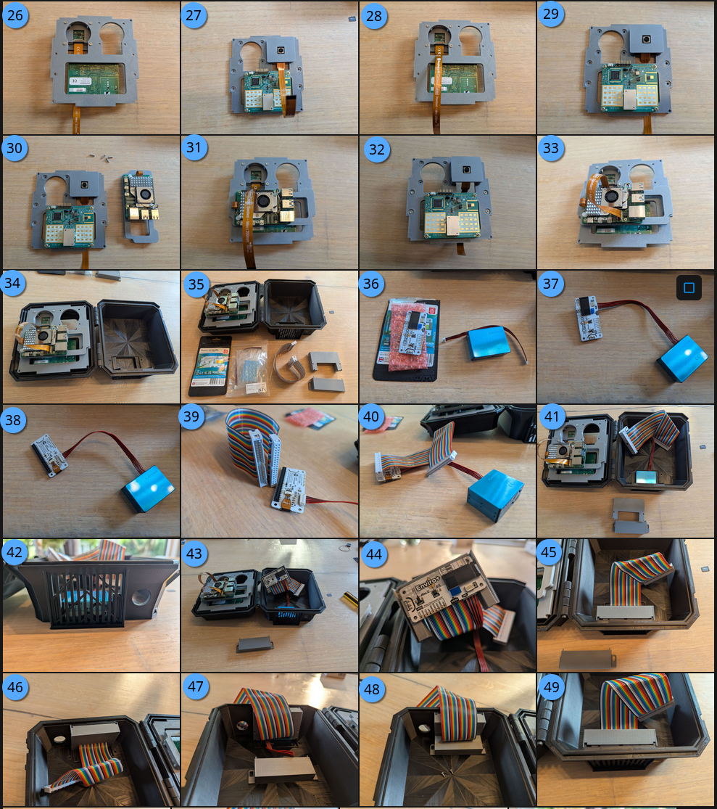
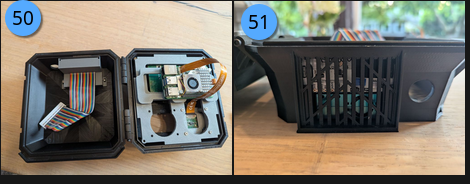
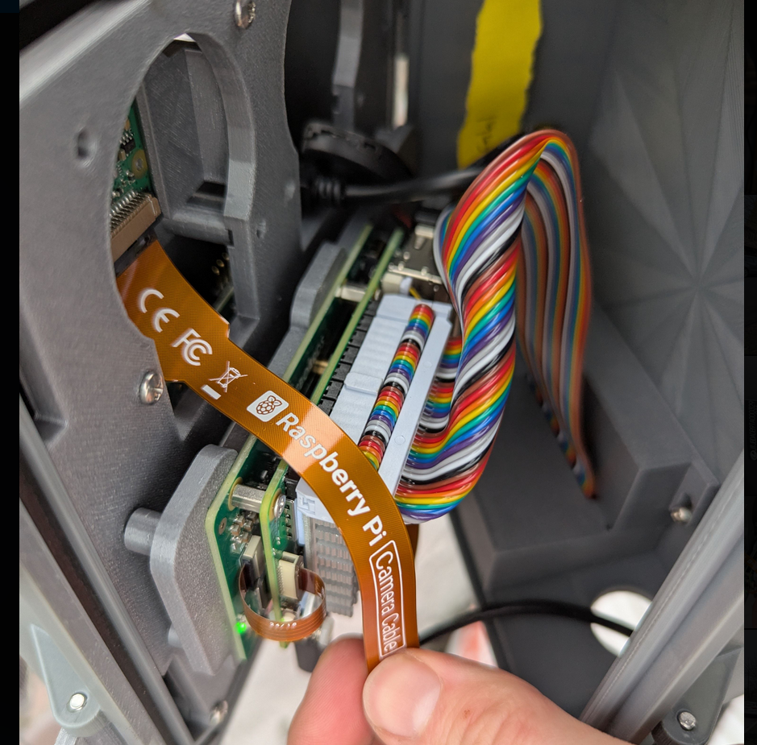
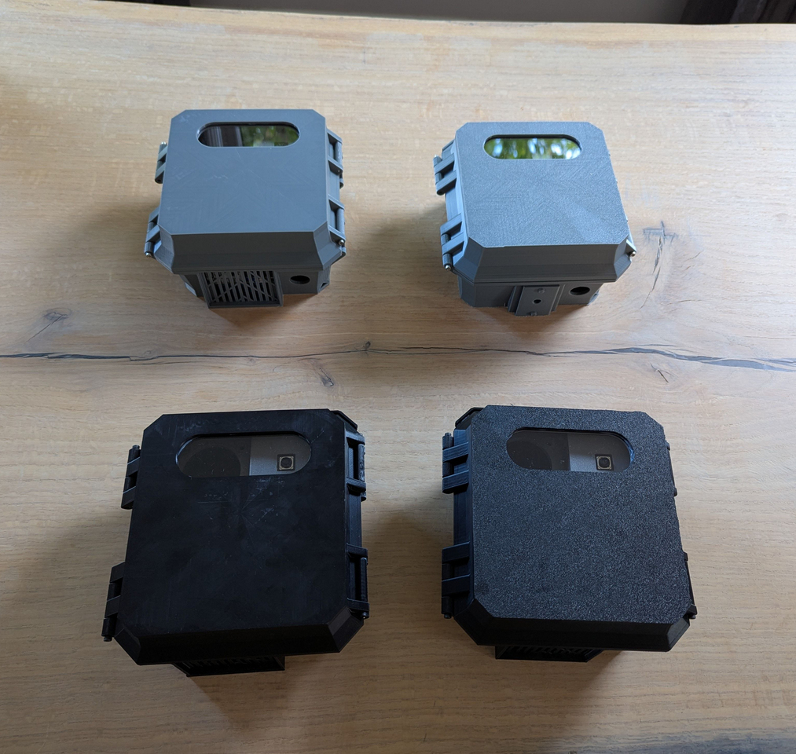

# Assembly Instructions


The assembly instructions assume you have the [recommended-hardware.md](../recommended-hardware.md "mention").


<figure><figcaption>
Full set of Traffic Monitor components ready for assembly
</figcaption></figure>

**Steps 1-34** show assembly of the Raspberry Pi 5 (RPi), Raspberry Pi 3 camera, Coral TPU HAT (or AI HAT+), and radar using the 3D printed enclosure.

**Steps 35-53** show assembly of the enviromental sensors (Enviro+ and Particulate Matter sensor).

## Core components

Assembly of the Raspberry Pi 5 (RPi), Raspberry Pi 3 camera, Coral TPU HAT (or AI HAT+), and radar using the 3D printed enclosure.

<figure><figcaption></figcaption></figure>

1. Lay out all your parts and screws
2. Lay out all your parts and screws (double-check)
3. M3x12mm screws for camera, M3x6mm screws for radar, M3x10mm screws for carrier board
4. Lay out all your parts and screws
5. (Coral TPU M.2 chip and HAT pictured) Unbox the AI co-processor and M.2 board (if separate)
6. (Coral TPU M.2 chip and HAT pictured) Attach the M.2 chip to the board, attach ribbon cable
7. Attach RPi active cooler to the RPi
8. Lay out HAT stand-offs
9. Attach stand-offs to board (bottom HAT version shown)
10. Plug in the PCIe ribbon cable (_pay close attention to so the triangle marks match up between the ribbon cable, RPi board, and HAT!)._
11. Attach HAT to RPi board (bottom HAT is shown for Coral TPU)
12. Locate the RPi carrier plate
13. Turn the RPi carrier plate with the built-in stand-offs pointing down
14. Mount the RPi and HAT to the carrier plate
15. Note bottom of carrier plate
16. Locate the radar and mounting board
17. Attach the radar to the mounting board with M3x6mm screws so the radar antenna (white and gold areas) are at the bottom and the micro-USB plug is near the camera cut-out.
18. Locate the camera, camera mounts, and camera ribbon cable
19. The camera may already contain a \[white] ribbon cable, this will not work with the RPi5, so remove it
20. Attach the RPi5 camera ribbon cable to the camera
21. Slide the camera into the first camera mounting plate
22. Snap on the other mounting camera plate so all the holes and pins align
23. The camera mount stand-offs will be on the back side and the first camera mount plate will be flush with the end of the stand-offs
24. Locate the main mounting board and assembled camera mount
25. Locate 4 M3x12mm screws for mounting the camera
26. (_Pictures contined below_) Mount the camera in either of the camera mount holes
27. Fully mounted radar and camera from the front
28. Slip the camera ribbon cable through the camera mounting hole to the back
29. Front view with camera ribbon cable through the back
30. Locate main mounting board, carrier plate, and M3x10mm screws
31. Attach the carrier board to the main board
32. Front view with carrier board attached
33. Plug in the camera ribbon cable to either of the RPi5 camera slots
34. Place the main mounting board into the enclosure, with the radar and camera in the top facing forward. Screw in M3x10mm screws into the 4 corners to secure.

## Environmental sensor components

The following are optional steps for air quality (AQ) sensors continued from above.

<figure><figcaption></figcaption></figure>

<figure><figcaption></figcaption></figure>

1. (35) Locate the environmental sensor equipment; Enviro+ board and Particulat Matter (PM) sensors
2. (36) Remove the enviro board and PM from packaging
3. (37) Attach the enviro board to the PM sensor
4. (38) Back view of enviro board
5. (39) Locate the GPIO ribbon cable
6. (40) Attach the GPIO ribbon cable to the enviro board with the ribbon cable wires going down (the ribbon cable notch will be on the top)
7. (41) Place the PM sensor into the slot, ensuring a tight fit into the pins on the bottom of the enclosure
8. (42) View of the PM sensor from the bottom
9. (43) Slip the enviro board into the air quality (AQ) carrier board.&#x20;
10. (44) The pins on the bottom of the AQ carrier board should align to the enviro board. It may be snug.
11. (45) Gently place the AQ carrier board into the alignment slots on the enclosure
12. (46) There should be almost no gaps around the carrier board and enclosure
13. (47) Fold the ribbon cable up and tuck the PM sensor cable on top of the PM
14. (48) Slide the AQ shroud into the slots, ensuring you can see the screw inserts. Screw in M3x8mm screws to secure AQ shroud.
15. (49) Front view of assembled AQ
16. &#x20;(50) Top view of assembled AQ
17. (51) External view of assembled AQ

### Attach the GPIO ribbon cable

Carefully attach the ribbon cable to the Raspberry Pi GPIO ports with the notch on the top.&#x20;

<figure><figcaption>
Carefully attach the AQ ribbon cable with notch towards outside of RPi5
</figcaption></figure>

Tips for working with the GPIO ribbon cable:

* It can help to pre-fold the ribbon cable so it sits flat when the case is closed.
* The ribbon cable will be tight on the pins and against the RPi active cooler heatsink.&#x20;
  * Carefully work the ribbon cable down moving from side-to-side a few milimeters at a time until fully onto seated onto the pins. &#x20;
* To remove the cable (unplugged the RPi before you remove it):
  * Carefully insert a flat-head screwdriver between the ribbon cable head and GPIO plastic header.&#x20;
  * Slowly work the GPIO cable off the pins from side-to-side, a few milimeters at a time. Be careful not to short the pins with the screwdriver.

## Ready to deploy!

Close the case, and it's ready to use!  🎉

<figure><figcaption>
Traffic monitors ready to count
</figcaption></figure>

