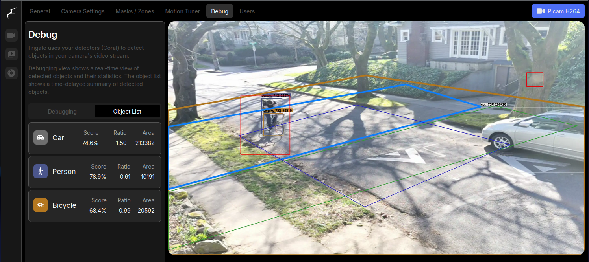

# Frigate Config

Object detection is powered by [Frigate NVR](https://frigate.video/), which provides powerful capabilities for tuning and reviewing events. The Traffic Monitor is not directly affiliated with the Frigate NVR project.

Refer to [Frigate Configuration](https://docs.frigate.video/configuration/) docs for full list of available configuration options and descriptions.

## Recommended Traffic Monitor Settings

The recommended Traffic Monitor settings attempts to optimize the Frigate config for **object detection on roadways**. Each deployment presents unique scenarios and challenges with accurate and precise object detection.&#x20;

View [frigate-config.yml](https://github.com/glossyio/traffic-monitor/blob/main/docker-frigate/frigate-config.yaml) for the sample.


Many settings will need to be uniquely tailored to your specific deployment.  See [deployment-and-mounting-guide.md](../deployment-and-mounting-guide.md "mention") for optimizing your placement.


## Optimizing Object Detection

You can more easily determine how your object detection is working through Frigate's Debug interface by going to **Frigate > Settings > Debug**.&#x20;

<figure><figcaption><p>Frigate > Settings > Debug to see how your object detection settings are working</p></figcaption></figure>

Fine-tuning object can help you with the following:

* detection (are you missing bikes or pedestrians?)
* reducing cross-classification (is an ebike being called a motorcycle?)
* minimizing false positives (is a tree being detected as a person?), see also [#defining-masks](frigate-config.md#defining-masks "mention")

The object detection model accuracy and detection ability may vary depending on a number of factors including mounting conditions such as height and angles to the roadway, camera quality and settings, and environmental conditions such as clouds, rain, snow, etc.&#x20;

The generalized model available in the base version works well at a variety of angles, but is particularly suited for an oblique angle that has a good side-view of objects as they pass through the frame. [Frigate object filters](https://docs.frigate.video/configuration/object_filters/#object-scores) have a variety of score and threshold parameters that may be set to be more effective with your deployment.&#x20;

### Sample Object Detection Fine-Tuning

The most relevant section of the Frigate config for fine-tuning object detection is the following. &#x20;

In this sample, bicycle threshold is set very low to detect most types of bikes encountered on the roadway while motorcycle threshold is set high so even large ebikes don't get cross-classified as motorcycles:

```yaml
objects:
  track:
  - bicycle
  - person
  - car
  - motorcycle
  - dog
  # Optional: filters to reduce false positives for specific object types
  filters:
    bicycle:
      # Optional: minimum width*height of the bounding box for the detected object (default: 0)
      min_area: 0
      # Optional: maximum width*height of the bounding box for the detected object (default: 24000000)
      max_area: 24000000
      # Optional: minimum width/height of the bounding box for the detected object (default: 0)
      min_ratio: 0.2
      # Optional: maximum width/height of the bounding box for the detected object (default: 24000000)
      max_ratio: 10.0
      # Optional: minimum score for the object to initiate tracking (default: shown below)
      min_score: 0.25
      # Optional: minimum decimal percentage for tracked object's computed score to be considered a true positive (default: shown below)
      threshold: 0.42
    motorcycle:
      min_area: 0
      max_area: 24000000
      min_ratio: 0.2
      max_ratio: 10.0
      min_score: 0.5
      threshold: 0.8
```

## Defining Masks

Another tool for reducing false-positives, creating private areas, and refining your configuration.  To access this capability, log into your Frigate interface and go to [Frigate > Settings > Motion Masks](https://docs.frigate.video/guides/getting_started/#step-5-setup-motion-masks).


Use masks sparingly. _Over-masking will make it more difficult for objects to be tracked._  See [Frigate masks](https://docs.frigate.video/configuration/masks).


1. **Motion Masks**:  may be designated to prevent unwanted types of motion from triggering detection.
2. **Object filter masks**: filter out false positives for a given object type based on location.

For detailed information visit [Frigate > Masks](https://docs.frigate.video/configuration/masks).
