# Deployment and Mounting Guide

Deployment encompasses geographic location and bearing, physical hardware mounting, angle of camera and device to roadway, and configuration to make it ready to detect objects.


**Warning:** Ensure compliance with all applicable laws and local regulations when installing, mounting, and deploying a traffic monitor, particularly in public spaces. Unauthorized surveillance can lead to legal consequences and infringement of privacy rights. Always consult with legal professionals or local authorities if you are unsure of the requirements. Information in this guide is for educational purposes, and you are responsible for adhering to applicable laws and consequences of the deployment and use of the traffic monitor.

Ensure you are mounting the traffic monitor in an approved area to comply with local regulations, and avoid attaching it to utility poles without proper authorization.


## Mounting capabilities


When selecting what mount method to use, an important consideration is how to make fine adjustments, especially for fine-tuning the radar angle and position.


The open source, 3D printed [#enclosure-weather-resistant-box](recommended-hardware.md#enclosure-weather-resistant-box "mention") has multiple built-in methods for mounting, depending on the variant, including:

* 1/4"-20 screw insert hole on bottom and/or back for camera-style and trail camera mounting hardware
* VESA mount -compatible holes (75 and 100 mm)
* Arca-Swiss Quick Release System -compatible plate on bottom for tripods
* Strap mount slots on back to directly attach to posts, poles, and trees
* Safety tether hole for just-in-case carabiner and strap

<figure>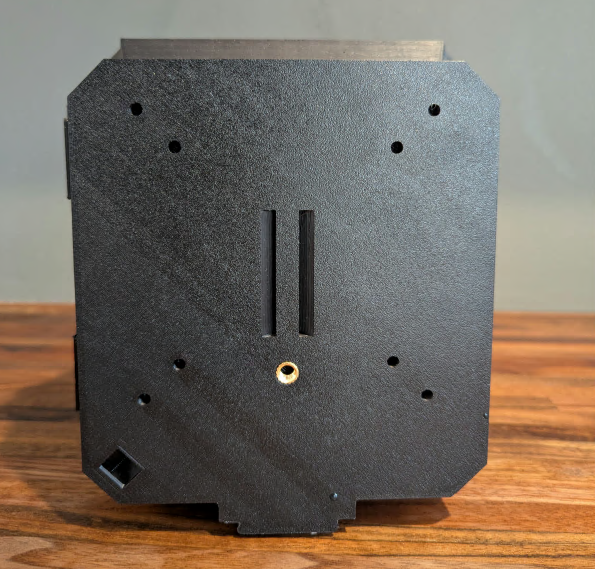<figcaption>
Back with VESA mount holes, 1/4"-20 mm screw insert, strap slots, and safety tether hole (lower-left)
</figcaption></figure> <figure>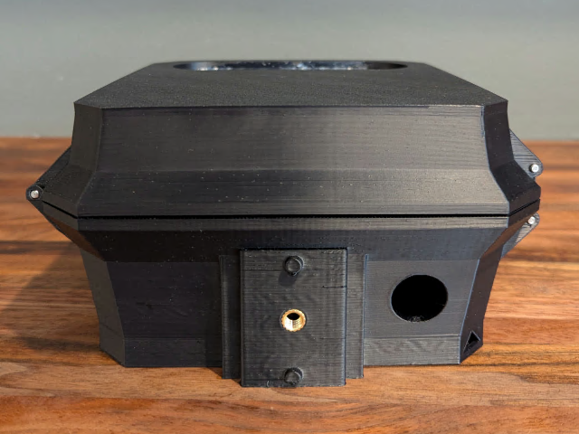<figcaption>
Bottom of the standard enclosure with arca-swiss quick release plate and 1/4"-20 mm screw insert
</figcaption></figure>

## Temporary deployments

In scenarios where you need counts for only a few hours—such as during events or point-in-time research—the Traffic Monitor performs well when mounted at or above head height in locations offering an unobstructed view of the roadway. A sturdy tripod and a compact portable power station are ideal for this setup.

<figure>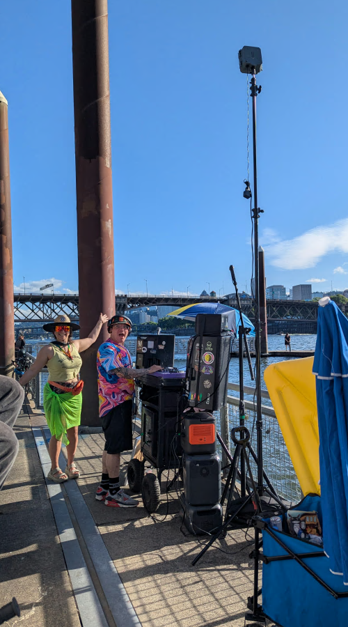<figcaption>
Traffic Monitor on a 16-foot telescoping tripod to count event participants
</figcaption></figure> <figure>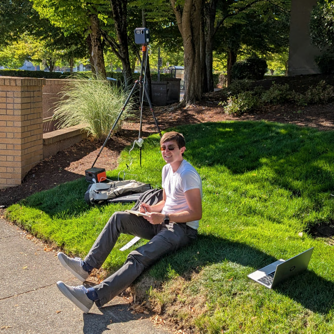<figcaption>
Researcher recording manual confirmation counts with a Traffic Monitor on a camera tripod plugged into a portable power station
</figcaption></figure>

## Permanent deployments


**Safety Note**: When installing the camera, always use proper safety equipment and practice ladder safety. Ensure that the camera is securely mounted, and verify that all mounting components are tightly fastened, safety tethers are in place, and check for stability to guarantee safe and reliable operation. Failure to do so could result in injury or damage to property.


The Traffic Monitor provides 24/7 roadway monitoring capabilities, depending on the sensors you have installed.

Long term deployments may be done in a variety of ways. As long as you have a good view of the roadway for the camera and can properly orient the radar, there's a variety of mounting methods you can employ.

From garage roofs to wood posts in a 5-gallon cement-filled bucket to a high stone pillar, it is a good idea is to keep the Traffic Monitor out of reach and in a place that will not be obstructed.

<figure>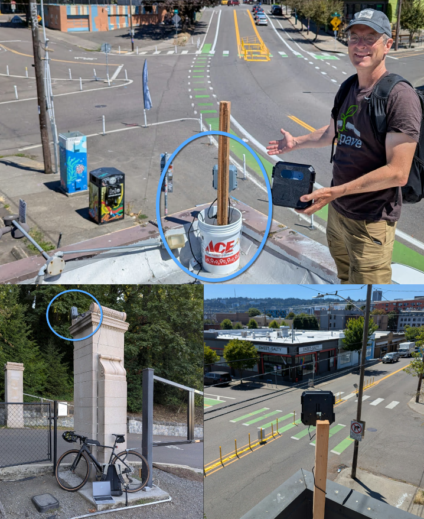<figcaption>
Long-term deployments with permission on private rooftops and gate entrances.
</figcaption></figure>

## Best practices for deployment

Ideal mounting locations will vary based on the use case and sensors. High-level tips include:

* Mount the device above the roadway, out of reach for the best view and to minimize tampering; e.g., 10-12 ft above the roadway.
* Choose a clear view of the road. Note that objects will still be tracked even if they temporarily move behind an object such as a tree or lamp post.
* Consider where parked vehicles or common stopping locations will be, as they may affect the radar's ability to detect moving objects; i.e., don't point the radar directly at a parking spot.
* Camera object detection works anywhere in the camera's field-of-view, so position the camera to get the most complete view of the roadway.
* Consider what [Frigate zones](setup-guide.md#id-2.-configure-frigate-zones) you will need for your use case.

### Sample deployments and angle calculations

<figure>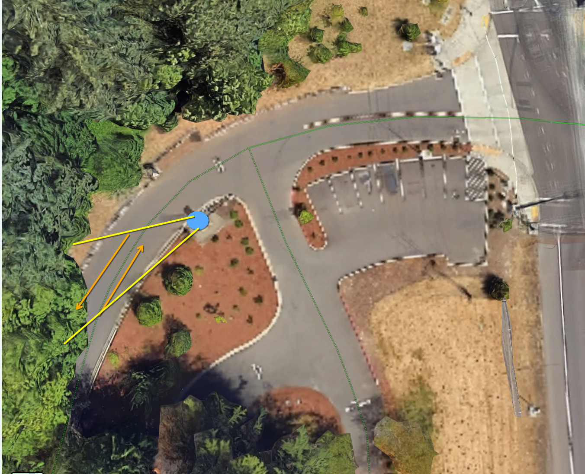<figcaption>
Quiet road, monitoring downhill movement
</figcaption></figure> <figure>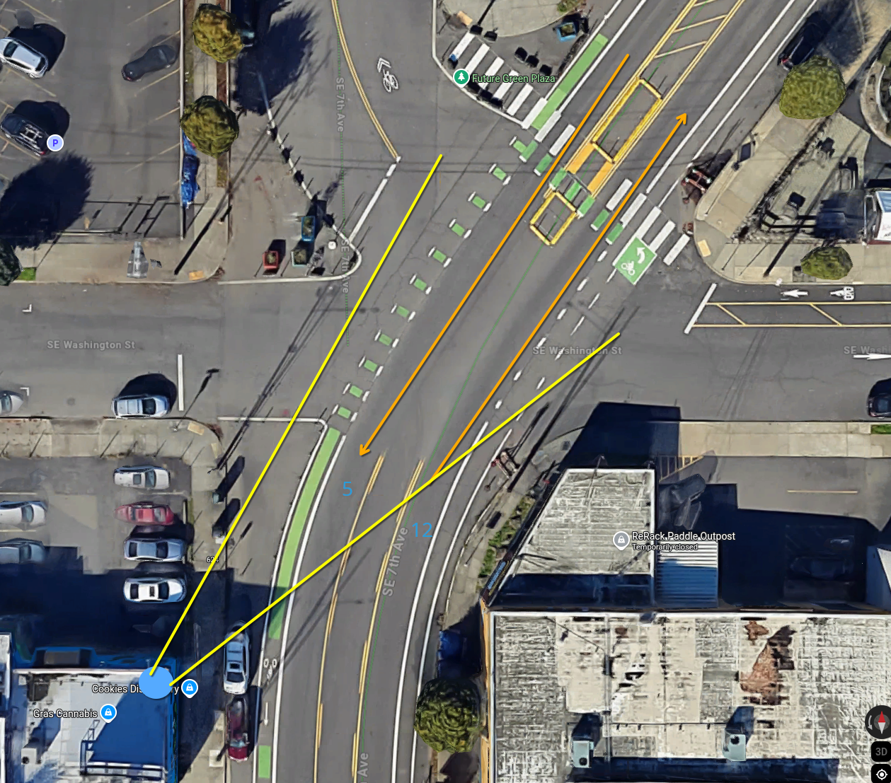<figcaption>
Busy business district, nearly straight-on object movement on wide road
</figcaption></figure> <figure>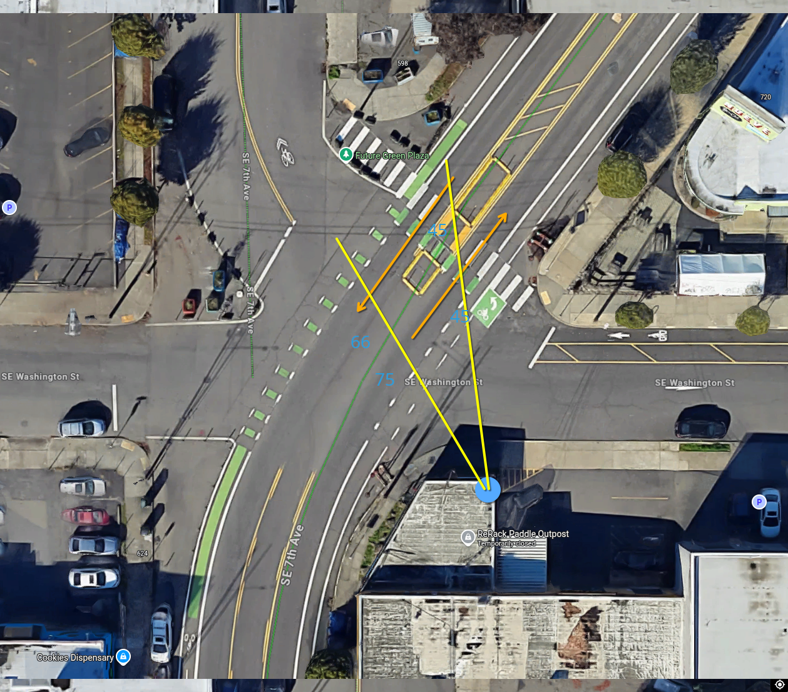<figcaption>
Busy business district, side-on monitoring focused on pedestrian and bike crosswalk
</figcaption></figure>

<figure>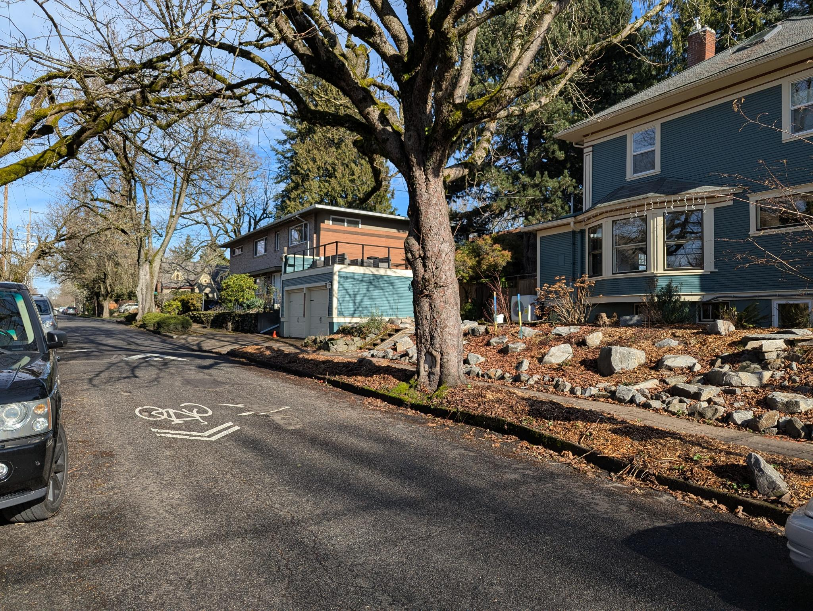<figcaption>
Neighborhood Greenway, an ideal spot to monitor roadway utilization for bikes, pedestrians, and cars
</figcaption></figure> <figure>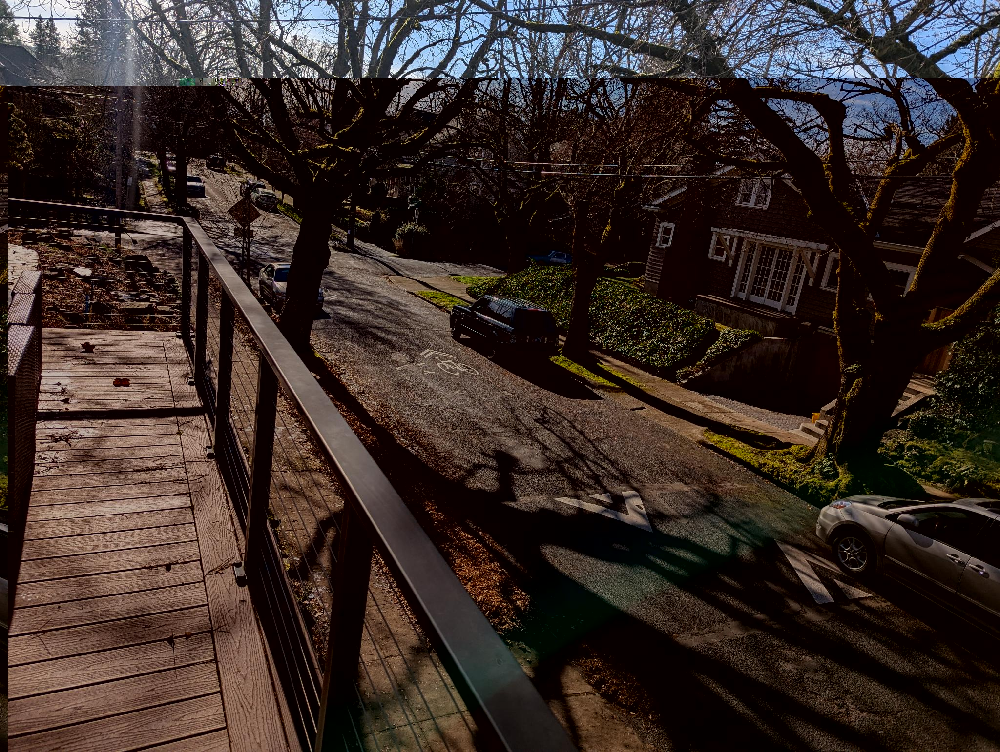<figcaption>
Neighborhood Greenway mounting spot, South-facing
</figcaption></figure> <figure>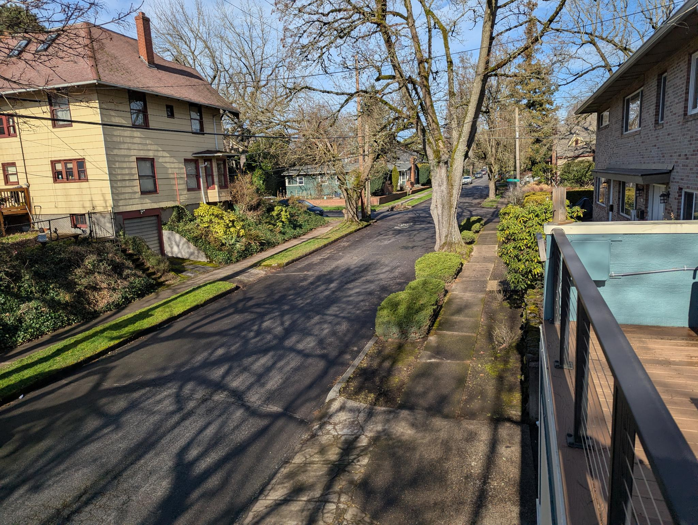<figcaption>
Neighborhood Greenway mounting spot, North-facing
</figcaption></figure>

### **Camera considerations**

**The camera** works best with an unobstructed view of the roadway for the best performance, but it is able to perform object detection anywhere in the camera frame.&#x20;

Focus on covering the entire area-of-interest, even if the camera is not centered on the roadway or area-of-interest.

<figure>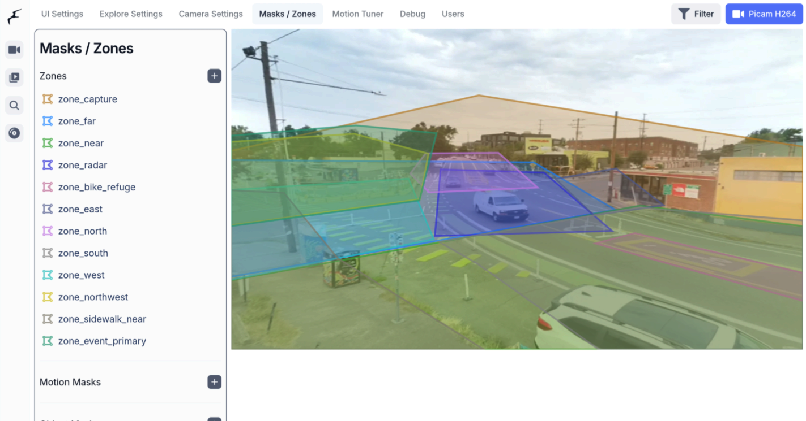<figcaption>
Detection events may occur anywhere in the camera field-of-view (FOV)
</figcaption></figure>

### **Radar considerations**

**The radar** has a narrower field-of-view (FOV) than most cameras and requires specific angles to the roadway for the most accurate speed measurements.&#x20;

Test the radar's capture area by having someone hold the radar unit (outside of the case) and watching the **red/blue blinking LEDs on the front of the radar** as you move towards and away from the unit. Watch the LEDs as objects move through the view and determine the boundaries for drawing the zone.

Optimizing speed measurements:

* The Traffic Monitor and radar should be at an **acute angle to the direction of travel** for desired objects (ideally 45-degrees or less). &#x20;
* See [Omnipresense Field of View calculator](https://omnipresense.com/ops243-field-of-view-calculator/) for more info on cosine correction.
* Object movement direction will be labeled as `inbound` and `outbound`, so consider locating the radar with objects coming towards the radar in a way that makes sense for those movements.

## Next Steps

Power on the Traffic Monitor (once it is plugged in to a power source it should automatically start, check for the green LED) and proceed to [setup-guide.md](setup-guide.md "mention") to connect and configure it.
