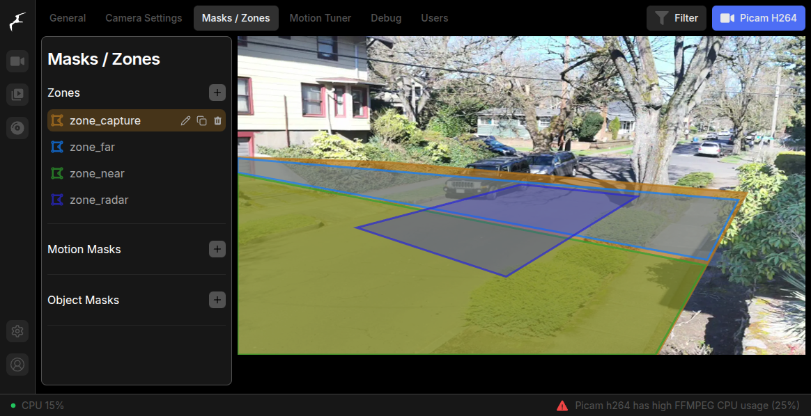

# Deployment and Mounting Guide

Deployment encompasses geographic location and bearing, physical hardware mounting, angle of camera and device to roadway, and configuration to make it ready to detect objects.

## Deployment and Mounting


**Warning:** Ensure compliance with all applicable laws and local regulations when installing, mounting, and deploying a traffic monitor, particularly in public spaces. Unauthorized surveillance can lead to legal consequences and infringement of privacy rights. Always consult with legal professionals or local authorities if you are unsure of the requirements. Information in this guide is for educational purposes, and you are responsible for adhering to applicable laws and consequences of the deployment and use of the traffic monitor.

Ensure you are mounting the traffic monitor in an approved area to comply with local regulations, and avoid attaching it to utility poles without proper authorization.


### Temporary

The traffic monitor may work very well at head-height mounted anywhere with an unobstructed view of the roadway.  A sturdy camera tripod works well for this situation.

\[Image of tripod mount]

\[Image of other temporary equipment]

### Permanent


**Safety Note**: When installing the camera, always use proper safety equipment, such as gloves and safety goggles and ladder safety to protect yourself. Ensure that the camera is securely mounted, particularly in public spaces, to prevent tampering or accidental damage. Failure to do so could result in injury or damage to property. Verify that all mounting components are tightly fastened, safety tethers are in place, and check for stability to guarantee safe and reliable operation.


### Choose a mounting location

\[link to omnipresence installation]

\[show image of roadway with height, vertical angle, horizontal angle, and calculations]

### Angle the traffic monitor

This will be dependent on the hardware you have chosen to install:

* **The camera** needs an unobstructed view of the roadway for the best performance, but it is able to perform object detection anywhere in the camera frame.
* **The radar** has a narrower field-of-view (FOV) than most cameras and requires specific angles to the roadway for the most accurate speed measurements.

\[show image of sample roadway]

## Post-deployment Configuration

### Configure Zones

The Traffic Monitor will be expecting a number of [Frigate zones](https://docs.frigate.video/configuration/zones/) to work properly with all dashboards and logic.  These need to manually designated, based on your deployment.


Ensure following [Frigate zones](https://docs.frigate.video/configuration/zones/) are manually configured each time a the traffic monitor is re-positioned or relocated, based on your unique deployment . &#x20;


Access Frigate's interface by going to `http://<TM_IP_ADDRESS>:5000` and go Settings > Configure > Masks / Zones.

Set up the following zones:

* <mark style="color:red;">zone\_capture</mark> - Set to capture the entire roadway, including sidewalks that are clearly in view for counting objects.
* <mark style="color:red;">zone\_near</mark> - Paired with `zone_near`, this will determine if an object moves "outbound" or "inbound". Set this to be roughly the further half of the `zone_capture` region.
* <mark style="color:red;">zone\_far</mark> - Paired with `zone_far`, this will determine if an object moves "outbound" or "inbound". Set this to be roughly the closer half of the `zone_capture` region.
* <mark style="color:red;">zone\_radar</mark> - (for units equipped with radar) - This should correspond to the field of view for the radar (where it can pick up accurate measurements) on the street. It will roughly make a rectangle in the center of the camera field of view from curb to curb.

<figure><figcaption>
Properly configured Frigate Zones
</figcaption></figure>

### Define Masks

Optional step for reducing false-positives, creating private areas, and refining your configuration.


Use masks sparingly. _Over-masking will make it more difficult for objects to be tracked._  See [Frigate masks](https://docs.frigate.video/configuration/masks) for more detailed explanation of how masks work and how to use them.


**Motion Masks**:  may be designated to prevent unwanted types of motion from triggering detection.

**Object filter masks**: filter out false positives for a given object type based on location.

For more information view [Frigate > Setup > Motion Masks](https://docs.frigate.video/guides/getting_started/#step-5-setup-motion-masks) and detailed info at [Frigate > Masks](https://docs.frigate.video/configuration/masks).

## Notes

### Optimize Object Detection

The object detection model accuracy and detection ability may vary depending on a number of factors including mounting conditions such as height and angles to the roadway, different cameras and camera settings, and environmental conditions.&#x20;

The generalized model available in the base version works well at a variety of angles, but is particularly suited for an oblique angle that has a good side-view of objects as they pass through the frame. [Frigate object filters](https://docs.frigate.video/configuration/object_filters/#object-scores) have a variety of score and threshold parameters that may be set to be more effective with your deployment.&#x20;
