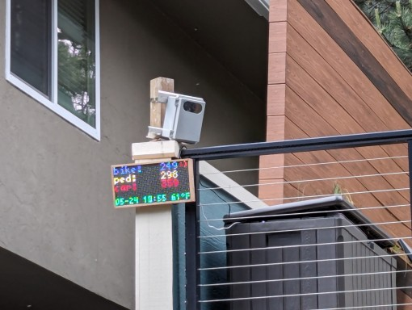

# Getting Started

## Step 1: Get your Traffic Monitor

The traffic monitor requires the [Recommended Hardware](recommended-hardware.md) and [software installation](build-your-own-device-diy/software-installation.md) before you can begin capturing roadway data.

There are two ways to get started:

<table data-card-size="large" data-view="cards"><thead><tr><th></th><th></th><th></th><th data-hidden data-card-cover data-type="files"></th><th data-hidden data-card-target data-type="content-ref"></th></tr></thead><tbody><tr><td><strong>Build It!</strong>  </td><td>See our <a href="build-your-own-device-diy/">Build your own device (DIY)</a> guide. The software is open source and components are available retail.</td><td>Customize to your heart's content.</td><td><a href=".gitbook/assets/icon-diy-350x200px-black-bg_grey.png">icon-diy-350x200px-black-bg_grey.png</a></td><td><a href="build-your-own-device-diy/">build-your-own-device-diy</a></td></tr><tr><td><strong>Buy It!</strong></td><td>(<em>coming soon)</em></td><td>Purchase a pre-built traffic monitor or kit from the Roadway Biome Project.</td><td><a href=".gitbook/assets/icon-shop-350x200px-black-bg_grey.png">icon-shop-350x200px-black-bg_grey.png</a></td><td></td></tr></tbody></table>

## Step 2: Plan your Deployment

The traffic monitor must be placed with a good view of the roadway. See the [deployment-and-mounting-guide.md](deployment-and-mounting-guide.md "mention") for more information on the most common deployment types:&#x20;

1. [#temporary](deployment-and-mounting-guide.md#temporary "mention") deployments allow you to set up on the right-of-way or sidewalk next to a roadway to get counts for a short time.
2. [#permanent](deployment-and-mounting-guide.md#permanent "mention") deployments are geared towards setting up a traffic monitor in a location to get 24/7 counts and monitoring.

## Step 3: Set up your Device


Before you set up the device, be sure to follow the [software-installation.md](build-your-own-device-diy/software-installation.md "mention")guide.


After you have your traffic monitor built, software installed, and physically set up (mounted), it is time to boot it up!  To get the best data and most out of the device, follow these steps:

1. [setup-guide.md](setup-guide.md "mention")
2. [frigate-config.md](configuration/frigate-config.md "mention") will guide you in setting up the object detection capabilities by turning on the camera and detection and defining zones.
3. [node-red-config.md](configuration/node-red-config.md "mention") will turn on additional data collection capabilities, such as pairing your camera with the radar and other sensors, sharing your de-identified event data with another system or data provider, and more!&#x20;

## Step 4: Collect and Share that Data

The traffic monitor will now run 24/7 collecting the data you set up. It will automatically restart if the power cycles, even if you are not there to reset it.

You can view the on-device dashboards, review event snapshots and clips in Frigate, download the local database, or view data shared with another data provider.

There are other projects out there that even pair the Traffic Monitor with physical displays to show daily counts of cars, bikes, and pedestrians.  The sky is the limit!  Learn more and share via the [TM GitHub Show and tell](https://github.com/glossyio/traffic-monitor/discussions/new?category=show-and-tell) or our [TM Zulip chat](https://trafficmonitor.zulipchat.com/).

<figure><figcaption>
LED Display showing daily counts capture with the traffic monitor
</figcaption></figure>
