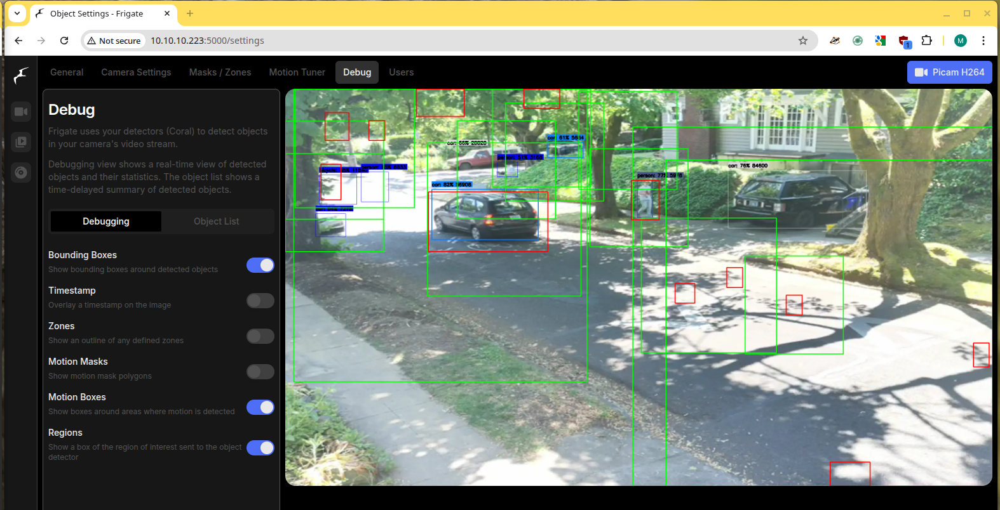

# Frequently Asked Questions

## How many simultaneous object detections can the traffic monitor handle?

> I am interested in using this in a location that is very congested. There could easily be 10 walkers and a few bikes in a single frame. Can it handle that many simultaneous detections? I am primarily looking for counts and direction of travel.

### Short answer

Yes, 👍 it can handle all that and more than you will throw at it. I think the biggest practical limitation for the Traffic Monitor is likely going to be when you have so many objects they "overlap" each other, so you can't tell if there is a person/bike behind another (think at the beginning of a marathon).

### Longer answer

We use the [Frigate NVR Project](https://github.com/blakeblackshear/frigate) to do the heavy lifting on object detection, decoding video, and motion detection. So, I am going to reference their documentation and discussions.

A couple of relevant discussions:

> if you have an inference speed of 10 milliseconds then that means you can run (1000 ms in a second / 10 milliseconds per inference) **100 object detection inferences per second**. Frigate often runs multiple inferences on a single camera frame, for instance when motion happens in two places at the same time, when an object was partially detected at the edge of a region and a larger region should be used, etc.

* from [https://github.com/blakeblackshear/frigate/discussions/7491](https://github.com/blakeblackshear/frigate/discussions/7491) (emphasis mine)

> The maximum number of detections per frame is determined by the largest number of disjoint movement zones, for which the upper bound then is equal to how many tiles of WxH, where WxH is model input dimensions, are needed to tile the full frame (not counting the region-connecting logic).

* from [https://github.com/blakeblackshear/frigate/discussions/18326](https://github.com/blakeblackshear/frigate/discussions/18326)

Some illustration of this. I have a quiet road today, but when the sun is casting shadows through the trees, Frigate is doing a lot of work to send various regions (green boxes) to object detection to "see" if any of that shadow motion is an object. The following image has more than 18 regions (that I can count) it is sending to object detection PLUS the 9(??) labeled objects it is tracking and sending. My inference speed was still sitting around 9ms, so the object detector could handle many more. The CPU spikes because of the video decoding and motion tracking, but with the RPi5 we still had quite a bit of overhead.

<figure><figcaption>
Roadway with many regions being sent to be checked for object detection because of motion and shadows.
</figcaption></figure>
