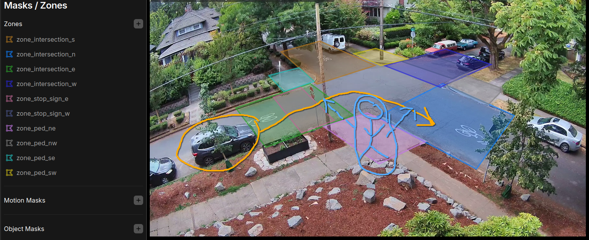

# Use Cases and Scenarios

We are only as powerful as the story we tell.  What can we do with the data we collect?  What can the traffic monitor do?

The TrafficMonitor.ai collects an extensive amount of data, depending on the sensors installed. For details on payloads, check out [events-payload.md](../sensor-payloads/events-payload.md "mention"), [radar-payload.md](../sensor-payloads/radar-payload.md "mention"), and [air-quality-aq-payload.md](../sensor-payloads/air-quality-aq-payload.md "mention").

## How can I perform a "near miss" analysis using this hardware?

This scenario is where there is a driver of a vehicle and a vulnerable road user like a pedestrian at the crosswalk at the same time.

This is an important and dangerous situation that has absolutely been largely un-captured in our current transportation system. **We need to create definitions on what a "near miss / near hit" is**, but we have laws we can follow for this. [PortlandBicycleSchool.com](https://portlandbicycleschool.com/driving-around-bicycles/driving-around-pedestrians-faq/) highlights many of these:

* In Oregon, _every corner is a crosswalk_. ORS 801.220
* Pedestrians invoke their right to cross when any part or extension of the pedestrian (body, cane, wheelchair, or bicycle) enters the crosswalk. ORS 811.028(4), 814.040(1)(a)
* A driver must remain stopped Until the pedestrian passes the driver’s lane (or lane they intend to turn into) plus one further lane. ORS 811.028

To accomplish this with the TrafficMonitor, the following would allow for analysis of events that have a driver / pedestrian conflict:

1. Mount a TM watching an intersection.
2. Draw zones that represent "pedestrian zones" and "driver zones".
3. This will create separate events for `person` and `car` with relevant [event payload fields](https://docs.trafficmonitor.ai/sensor-payloads/events-payload) including `start_time`, `end_time`, and `entered_zones`.
4. Watch for events where a driver enters the zone simultaneously as a pedestrian in their zone (overlapping start/end times) where the zones will be in conflict.
5. Download the data and create an analysis that looks at those potential conflicts.

Example scenario analysis:

* if a person was at the `zone_ped_ne` (bottom left) and wanted to cross S or W
* and a car simultaneously entered the `zone_intersection_e` (left) and wanted to turn into `zone_intersection_n`(right)
* and the car \_turned first\_ into the `zone_intersection_n` before the pedestrian crossed, based on `start_time` and `end_time` for both events
* This would potentially be a "near miss" or at least an illegal maneuver for a driver while a pedestrian was in the crosswalk.

You can potentially add in other elements to make the requires more stringent, like seeing if the car was stationary at the stop sign or just blew through it. Or tighten the "pedestrian zone" to represent the very edges of the sidewalk to show the pedestrian had "intent to cross".

<figure><figcaption>
Example of a potential near-miss scenario zone tracking set up.  Zones everywhere!
</figcaption></figure>

Of course, the truly more harrowing observations would include those where a `person` and `car` were in the same `zone_intersection` (on the road) at the same time. That would obviously be a "near miss" if it wasn't a true driver striking a pedestrian.
