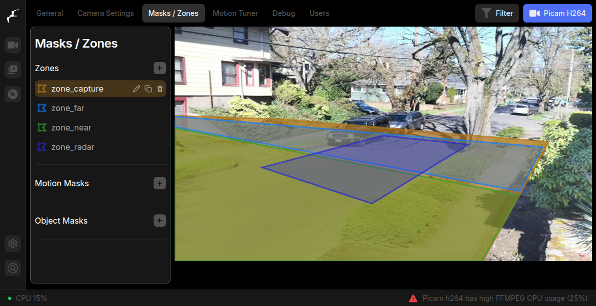

# Setup Guide

At this point you have [deployed](deployment-and-mounting-guide.md) your traffic monitor and it is running.  Nice job! &#x20;

This guide will walk you though configuring your device based on your sensors (required), adjust it for roadway conditions (recommended), optimize your data capture, and connect with the ThingsBoard platform (optional).

## Steps


The default configuration files have disabled all sensors until you follow these steps. There will be no data captured until you enable your sensors using the following steps.&#x20;


* [x] [#connect-to-your-device](setup-guide.md#connect-to-your-device "mention")
* [x] [#configure-frigate-zones](setup-guide.md#configure-frigate-zones "mention")
* [x] [#configure-node-red](setup-guide.md#configure-node-red "mention")

## 1. Connect to your Device

### Physical Access

Physical access to the device is a less-convenient method but will allow the most control to address issues.

#### Monitor, Keyboard, Mouse

See [Raspberry Pi Getting Started](https://www.raspberrypi.com/documentation/computers/getting-started.html#display) for more information on connecting your Raspberry Pi. It should be as simple as plugging in a USB keyboard, USB mouse, and micro HDMI cable to your monitor. In this case, you can use `localhost` as the RPi IP address or use the host name.

#### SD Card

If your Traffic Monitor uses the default Raspberry Pi installation method, you will have an [SD Card boot media](https://www.raspberrypi.com/documentation/computers/getting-started.html#sd-cards) that contains all your system files. If necessary, you can insert the card into a micro-SD card reader to access the entire Raspberry Pi OS directory structure.

### Remote Access

Remote access allows you to control various parts of your Raspberry Pi without connecting it to a monitor, keyboard, or mouse. This must be done from another computer, e.g. a laptop.  See [Raspberry Pi's remote access](https://www.raspberrypi.com/documentation/computers/remote-access.html#introduction-to-remote-access) docs for a full rundown of options.

You will need to know the Traffic Monitor / Raspberry Pi IP address or host name to connect to the various configuration environments. &#x20;

#### Finding Your IP address

* If you chose the [build-your-own-device-diy](build-your-own-device-diy/ "mention") route, we recommend you set up WiFi credentials by following the [Raspberry Pi Imager docs](https://www.raspberrypi.com/documentation/computers/getting-started.html#installing-the-operating-system) and it will automatically be accessible the network you specified. Find the RPi IP address via your router, or if your router supports DNS host names, you can use the host name set on the RPi.
* If you received a **pre-built device**, check with your provider for specific instructions. To get you started, it may be available as a Hotspot that will [host a wireless network](https://www.raspberrypi.com/documentation/computers/configuration.html#host-a-wireless-network-from-your-raspberry-pi). Connect to it like any WiFi network, look for the host name as the SSID. The IP address of the Raspberry Pi will be the Gateway IP address or you may use the host name set on the RPi.

See [Find the IP address of your Raspberry Pi](https://www.raspberrypi.com/documentation/computers/remote-access.html#ip-address) for more options.

## 2. Configure Frigate Zones

Frigate controls and generates object detection events with the camera.


This section describes setting up Frigate with the Traffic Monitor [recommended-hardware.md](recommended-hardware.md "mention"). If you have alternative or optional camera(s) or other components, you may need additional configuration. Reference the official [Frigate Configuration](https://docs.frigate.video/guides/getting_started#configuring-frigate) for more details.


&#x20;Frigate has a well-developed front-end user interface that can be accessed by visiting `http://<TM_IP_ADDRESS>:5000`  in a browser.

The Traffic Monitor will be expecting the following specifically named [Frigate zones](https://docs.frigate.video/configuration/zones/) to work properly with all dashboards and workflow logic.  These need to manually drawn based on your deployment.


Ensure following [Frigate zones](https://docs.frigate.video/configuration/zones/) are manually configured each time a the traffic monitor is re-positioned or relocated, based on your unique deployment and roadway conditions. &#x20;


Set up or modify the following zones, overlaying any temporary or permanent stationary objects:

1. <mark style="color:red;">zone\_capture</mark> - Set to capture the entire roadway, including sidewalks that are clearly in view for counting objects.
2. <mark style="color:red;">zone\_near</mark> - Paired with `zone_near`, this will determine if an object moves "outbound" or "inbound". Set this to be roughly the further half of the `zone_capture` region.
3. <mark style="color:red;">zone\_far</mark> - Paired with `zone_far`, this will determine if an object moves "outbound" or "inbound". Set this to be roughly the closer half of the `zone_capture` region.
4. <mark style="color:red;">zone\_radar</mark> - (for units equipped with radar) - This should correspond to the field of view for the radar (where it can pick up accurate measurements) on the street. It will roughly make a rectangle in the center of the camera field of view from curb to curb.

<figure><figcaption><p>Properly configured Frigate Zones</p></figcaption></figure>

After changes are made, you will need to restart Frigate before they take effect. You can do this via **Frigate > Settings > Restart Frigate**.

### Define Masks

Optional step for reducing false-positives, creating private areas, and refining your configuration.


Use masks sparingly. _Over-masking will make it more difficult for objects to be tracked._  See [Frigate masks](https://docs.frigate.video/configuration/masks) for more detailed explanation of how masks work and how to use them.


* **Motion Masks**:  may be designated to prevent unwanted types of motion from triggering detection.
* **Object filter masks**: filter out false positives for a given object type based on location.

For more information view [Frigate > Setup > Motion Masks](https://docs.frigate.video/guides/getting_started/#step-5-setup-motion-masks) and detailed info at [Frigate > Masks](https://docs.frigate.video/configuration/masks).

### Optimize Object Detection

The object detection model accuracy and detection ability may vary depending on a number of factors including mounting conditions such as height and angles to the roadway, different cameras and camera settings, and environmental conditions.&#x20;

The generalized model available in the base version works well at a variety of angles, but is particularly suited for an oblique angle that has a good side-view of objects as they pass through the frame. [Frigate object filters](https://docs.frigate.video/configuration/object_filters/#object-scores) have a variety of score and threshold parameters that may be set to be more effective with your deployment.&#x20;

## 3. Configure Node-RED

Node-RED controls most of the workflow logic and data collection.

You will need to [#connect-to-your-device](setup-guide.md#connect-to-your-device "mention") to edit the [node-red-config.md](configuration/node-red-config.md "mention") files.

1. Open up the terminal or via SSH enter the command: `nano ~/.node-red/config.yml` to begin editing the config file.
2. Change the deployment location information to represent the current deployment. Get your latitude and longitude from any map service, such as Google Maps and enter bearing with the single-letter cardinal direction the traffic monitor is facing.

```yaml
deployment:
    lat: 45.5225
    lon: -122.6919
    bearing: n
```

3. Modify sensors to reflect currently installed components. For example, with a single Raspberry Pi Camera and Radar, it may look like this:

```yaml
sensors:
    cameras:
        picam_h264:
            enabled: true
            camera_radar: TM_RADAR_SERIAL_PORT_00
    radars:
        TM_RADAR_SERIAL_PORT_00:
            enabled: true
```

4. To save changes, press Ctr+o (hold control and o)
5. To exit, press Ctr+x (hold control and x)

You will need to restart Node-RED for setting to take effect. Do this by entering the command `systemctl restart nodered` into the terminal.
