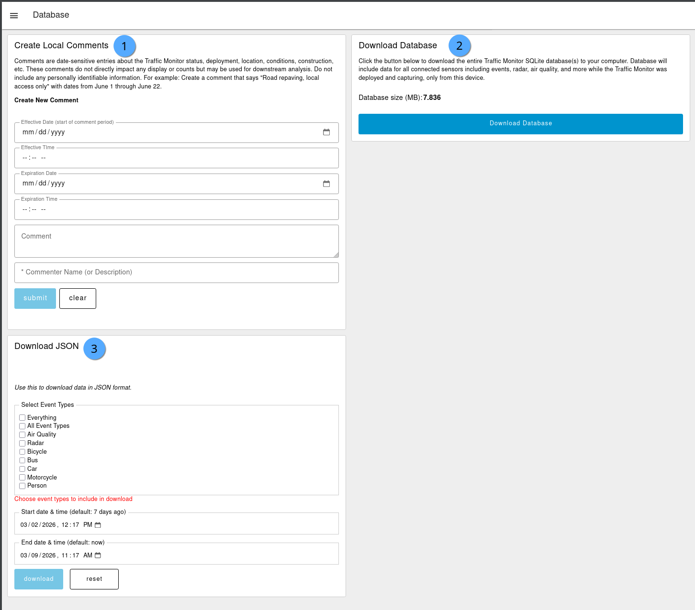

# Database

## Sample screenshot

<figure><figcaption></figcaption></figure>

## Descriptions

1. Create local comments: Operator-entered free-text comments that will be available in the `comments` table to be used for manual analysis. May be useful when adjusting settings (changed model or threshold), noting environmental conditions (road work happening), etc.
2. Download Database: Will trigger the entire database for download in unencrypted, compressed format.
   1. Very large databases may take several minutes to compress and download; e.g. 3 GB database file may take up to 5-minutes to compress and several minutes to download, depending on connection speed.
   2. Database size is indicated in [Megabytes (MB)](https://en.wikipedia.org/wiki/Megabyte)
   3. Database is in [SQLite](https://en.wikipedia.org/wiki/SQLite) format (`.sqlite`), a open-source relational database format. Read more at [sqlite.org](https://sqlite.org/). Once downloaded, you may browse database structure by using [sqlitebrowser.org](https://sqlitebrowser.org/) or programmatically via sqlite libraries; e.g.built-in [Python sqlite3 library](https://docs.python.org/3/library/sqlite3.html).
   4. Database is compressed in [Tar](https://en.wikipedia.org/wiki/Tar_\(computing\)) Gzip format (`.tar.gz`). On Linux or Mac, uncompress with `tar -xvzf`. On Windows download the open source [7-Zip](https://www.7-zip.org/) application.
3. Download JSON: Customizable data export in unencrypted, uncompressed [JSON](https://en.wikipedia.org/wiki/JSON) format by object event type or full tables with a data start/end date time. View in your preferred text editor.

