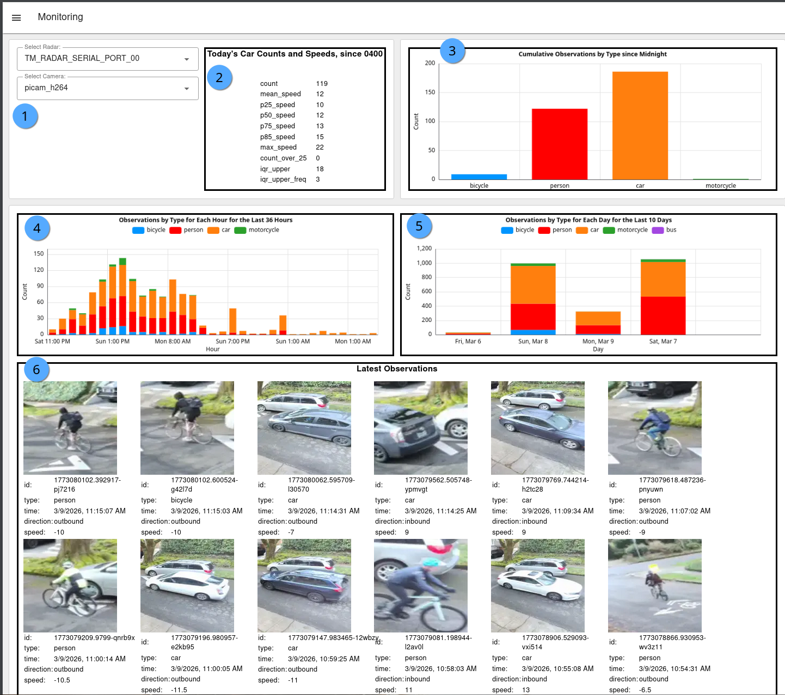

# Monitoring


The local, on-device Traffic Monitor dashboard is available by [connecting directly to your traffic monitor](../setup-guide.md#id-1.-connect-to-your-device) via a web browser.


The Monitoring tab display counts and descriptive statistics among all your sensors.

## Sample screenshot

<figure><figcaption>
Monitoring tab sample
</figcaption></figure>

## Descriptions

1. Select your Radar and Camera in case you have multiple sensors on the unit. Sensors need to be defined and enabled in the [node-red-config.md](../configuration/node-red-config.md "mention").
2. Displays `car` object speed counts and descriptive statistics for those that moved through `zone_radar`  since 0400 local time. Stats include:&#x20;
   1. count: Total count through valid area
   2. mean\_speed: Average speed among all cars
   3. p25\_speed: 25th [Percentile](https://en.wikipedia.org/wiki/Percentile) speed, also known as first quartile (Q1)
   4. p50\_speed: 50th Percentile speed, also known as [median](https://en.wikipedia.org/wiki/Median) speed
   5. p75\_speed: 75th Percentile speed, also known as third quartile (Q3)
   6. p85\_speed: 85th Percentile speed
   7. max\_speed: Maximum speed
   8. count\_over\_25: Static set number for maximum speed (25 in set system; e.g. 25 mph)
   9. iqr\_upper: [Interquartile range](https://en.wikipedia.org/wiki/Interquartile_range) (IQR) calculated as p75 + 1.5 \* IQR
   10. iqr\_upper\_freq: (frequency of cars above the iqr\_upper) Count of vehicles driving above the iq\_upper (considered [outliers](https://en.wikipedia.org/wiki/Outlier) that are significantly faster than other vehicles)
3. Daily cumulative counts for all [Frigate-enabled objects](https://docs.frigate.video/configuration/objects) since 0400 local time.
4. Hourly cumulative counts by object for the last 36 hours.
5. Daily cumulative counts by object for the last 10 days.
6. Latest observations (to display images, [Frigate snapshots](https://docs.frigate.video/configuration/snapshots/) must be enabled).
