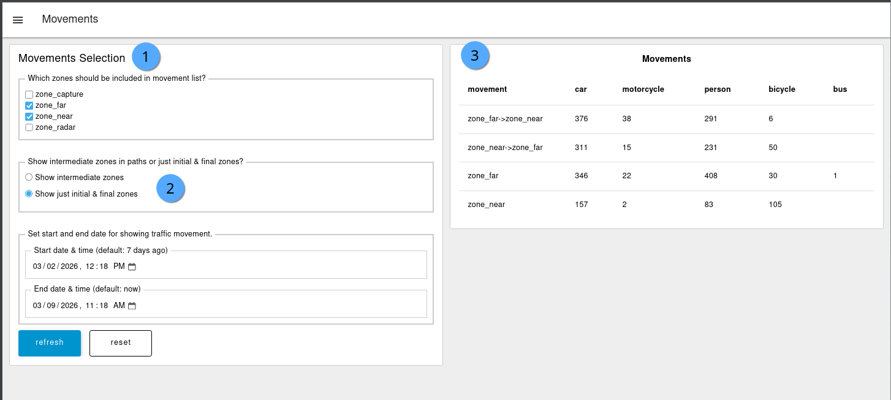

# Movements


Movement patterns are based on [Frigate Zones](https://docs.frigate.video/configuration/zones). Configure zones properly before analyzing movements.


The Movements tab allows operators to see counts of objects through zones. This is commonly used to provide confirmation counts against manual counts and to determine if deployment and zones provide accurate counts.

## Sample screenshot

<figure><figcaption></figcaption></figure>

## Descriptions

1. Movements Selection: Selectable filters to specify.
2. Movement behavior selection: Provides the ability to filter objects that go through _any_ of the selected zones or objects that go through _only selected zones_.
3. Table of counts by object for selected movement pattern filters.

## Example of complex movement patterns

A complex intersection provides potentially dozens of combinations of turning behaviors and movement. The movements tab provides the ability to confirm against manual counts.

<figure><figcaption>
Frigate zones configured with 12 zones drawn on a busy 5-way intersection
</figcaption></figure>

<figure><figcaption>
Example of manual, hand-written confirmation counts through various intersections (left image matches above zones)
</figcaption></figure>
